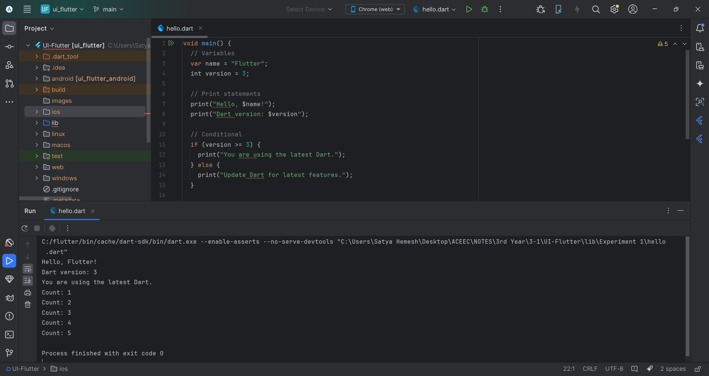
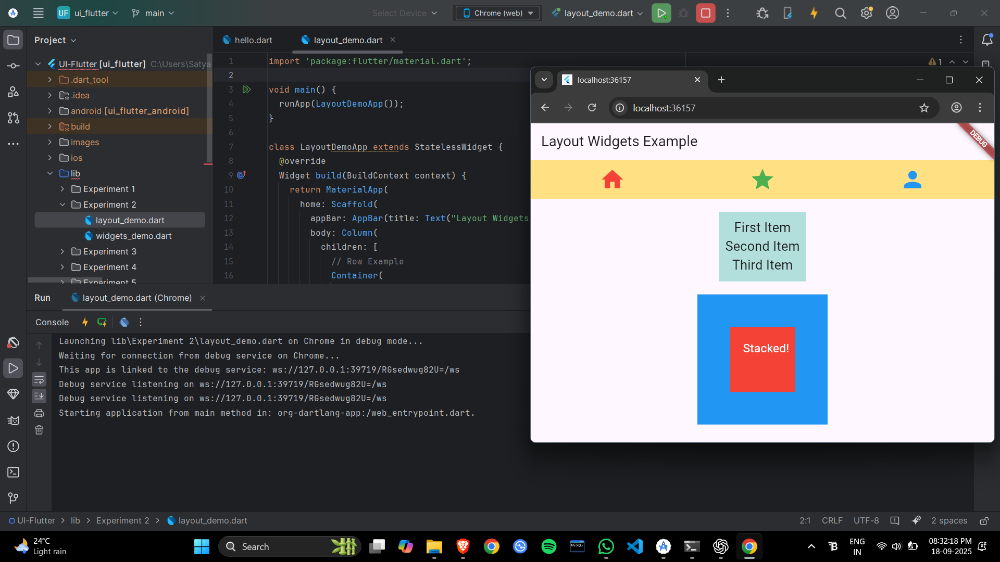
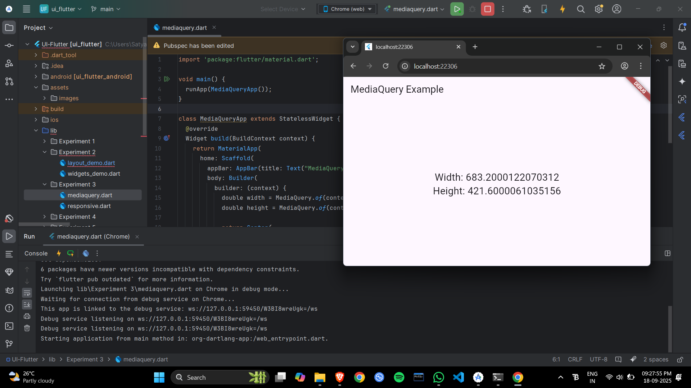
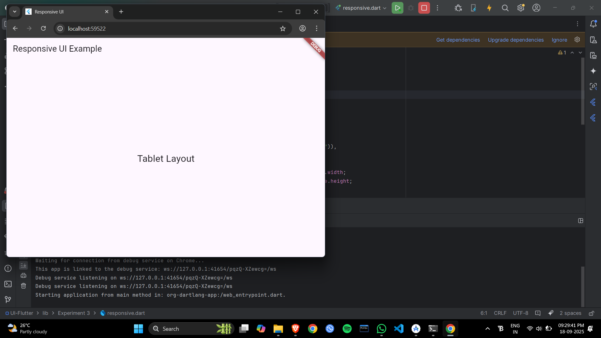

# Flutter UI Lab: Hands-On Experiments

Welcome to the Flutter UI Lab! This collection features five practical experiments (from Experiment 1 to 5) designed to explore various aspects of building user interfaces with Flutter. Each one highlights unique features, from simple layouts to advanced animations, helping you get a feel for Flutter's capabilities.

# What You'll Need

Flutter SDK (version 2.0 or higher)
Your choice of IDE: Android Studio or Visual Studio Code
A simulator for Android/iOS or a physical device for testing

# Navigation

Experiment 1  
Experiment 2  
Experiment 3  
Experiment 4  
Experiment 5 

# Experiment 1
Where to Find It / Key Files

Core code: lib/experiment1/main.dart  
Visual aid: assets/images/experiment1.png

Brief Overview
This setup dives into foundational Flutter concepts, showcasing straightforward widget arrangements and basic interface building.

# Visuals  

# Getting It Running

Navigate to the experiment's directory in your IDE (VS Code or Android Studio).  
Install dependencies with flutter pub get.  
Launch it using flutter run on your emulator or device.  

# Experiment 2
Where to Find It / Key Files  

Core code: lib/experiment2/main.dart  
Visual aid: assets/images/experiment2b.png  

# Brief Overview  
Here, the emphasis is on creating dynamic, user-responsive components and tweaking widgets for a custom look.  
# Identified Files

lib/experiment2/main.dart  
lib/experiment2/widgets/custom_widget.dart  

# Visuals  

# Getting It Running

Head to the experiment folder.  
Grab dependencies via flutter pub get.  
Start the app with flutter run.  

# Experiment 3
Where to Find It / Key Files

Core code: lib/experiment3/main.dart  
Visual aids: assets/images/experiment3a.png, assets/images/experiment3b.png  

# Brief Overview
Explore screen transitions, app navigation, and handling multi-page interfaces in Flutter.  
Identified Files  

lib/experiment3/main.dart
lib/experiment3/screens/home_screen.dart

# Visuals

  

# Getting It Running

Load the folder into your IDE.  
Fetch packages with flutter pub get.  
Test it out on a simulator or connected device.  

